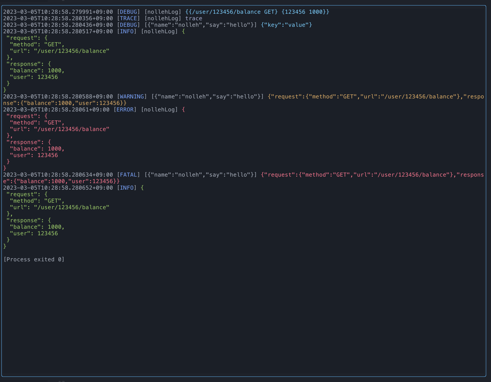

## caption-json-formatter
logrus's 'message' json formatter with human-readable caption added.  
default available caption is 

> * timestamp
> * logLevel
>

### Example 

#### OutPut  




#### Source
initalization
```go
// initialize log
var (
	logger = NewLogger()
)

func NewLogger() *logrus.Logger {
	log.SetFlags(log.LstdFlags | log.Lshortfile)
	log.SetOutput(os.Stdout)

	logger := logrus.New()
	logger.Level = logrus.TraceLevel
	//entry := caption_json_formatter.Entry{ Entry: logrus.NewEntry(logger) }
	//logger.SetFormatter(&caption_json_formatter.Formatter{Entry: &entry, PrettyPrint: true })
	logger.SetFormatter(&caption_json_formatter.Formatter{ PrettyPrint: true })
	return logger
}

func Log() *caption_json_formatter.Entry {
	return &caption_json_formatter.Entry{ Entry: logrus.NewEntry(logger) }
}
```

printLog
```go
func main() {

    type Request struct {
            Url string `json:"url"`
            Method string `json:"method"`
        }
        type Response struct {
            User int `json:"user"`
            Balance int `json:"balance"`
        }
        type Message struct {
            Request Request `json:"request"`
            Response Response `json:"response"`
        }
    
        message := Message { Request{ "/user/123456/balance", "GET" },
            Response{123456, 1000} }

        /* in current logrus implementation, there isn't way for set Custom Entry
         * hook or formatter, doesn't have opportunity for marshaling message.
         * so before pull request was made, you need to use custom function to use extended entry.
         */

        Log().DebugC("description: hello this is nolleh!", message)
}
```

### When To Use 
it is useful when shows 'message' that include json to human.   
show as pretty format, eventhought there is nested json. **(not strigified)**

for example, for message 

````go
// accessData is json type that has request / reponse data
log.Debug(accessData)
````

````
[2020-01-20T16:46:08.7452971+09:00] [Debug]
{
    "request": {
        "headers": { "content-type": "application/json" }, 
        "method": "GET", 
        "route": "/user/{userId}/balance",
        "url": "/user/123456/balance"
    }, 
    "response": {
        "body": {
            "userId": 123456,
            "balance": 1000
        }
    }
}
````

not like other formatters doing. (like below)

```
[2020-01-20T16:46:08.7452971+09:00] [Debug] {/"request/": { /"headers/": { /"content-type/": /"application/json/" }, /"method/": /"GET/", /"route/": /"/user/{userId}/balance/", /"url/": /"/user/123456/balance/" }, /"response/": { /"body/": { /"userId/": 123456, /"balance/": 1000 } } }
```

or 


```
{ "time": "2020-01-20T16:46:08.7452971+09:00", "msg": {/"request/": { /"headers/": { /"content-type/": /"application/json/" }, /"method/": /"GET/", /"route/": /"/user/{userId}/balance/", /"url/": /"/user/123456/balance/" }, /"response/": { /"body/": { /"userId/": 123456, /"balance/": 1000 } }
```

or

```
"2020-01-20T16:46:08.7452971+09:00" {{/user/123456/balance GET} {123456 1000}}"
```